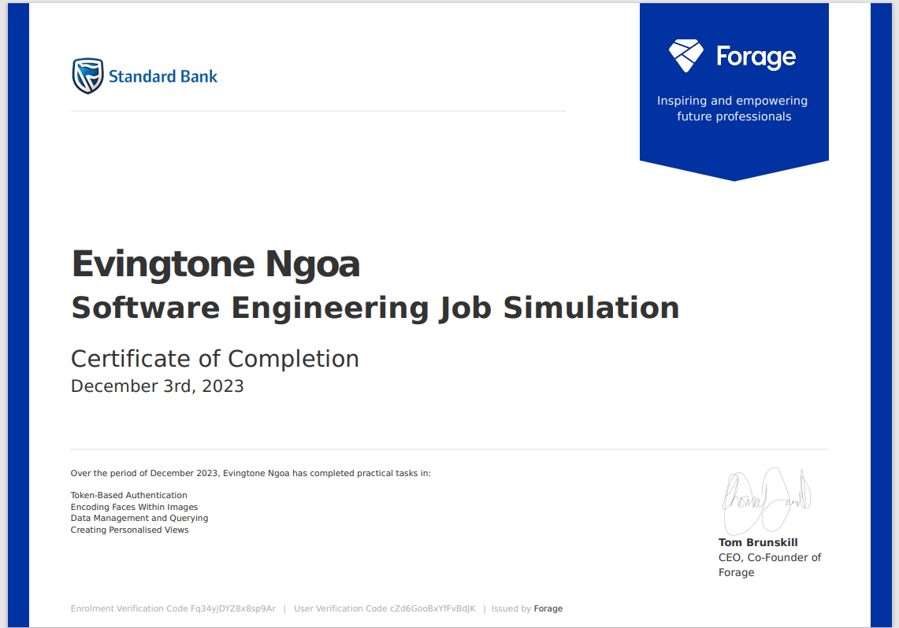
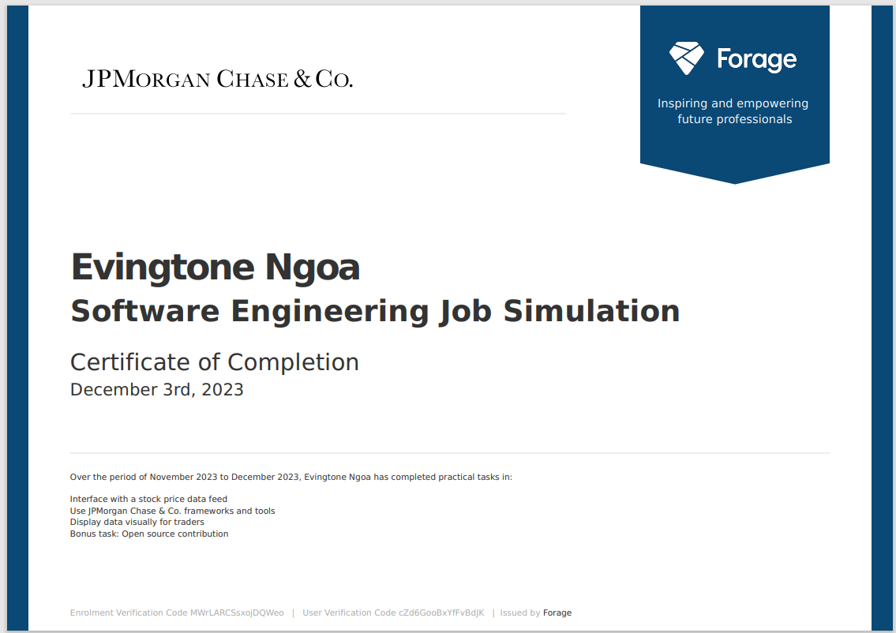

# STANDARD BANK FORAGE VIRTUAL EXPERIENCE
- [Forage](https://www.theforage.com/simulations?companies=standard-bank/) - Standard Bank Virtual Experience Programs

## Task 1:
- Token based authentication service.
- [Spring JWT](https://github.com/Evin-Ngoa/sbg-forage-virtual-experience/tree/main/auth-service/) Repository

## Task 2:
- Python script designed to encode faces within images & deployed as an AWS Lambda function.
- [Lambda Function](https://github.com/Evin-Ngoa/sbg-forage-virtual-experience/tree/main/encoding-faces-within-images/) Repository 

## Task 3:
- Write SQL queries that retrieve data from Teradata for various scenarios.
- [Teradata Sql](https://github.com/Evin-Ngoa/sbg-forage-virtual-experience/tree/main/teradata-sql/) Repository 

## Task 4:
- Create a personalized view using above SQL query in a django application
- [Django](https://github.com/Evin-Ngoa/sbg-forage-virtual-experience/tree/main/dashboardmbservice/) Repository 

## Other 
